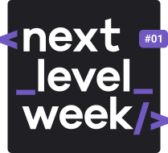

# E-coleta
Projeto desenvolvido durante a Next Level Week #01

</img>

<h1 align="center">Next Level Week #01</h1>

Projeto <strong>Ecoleta</strong> desenvolvido durante a Next Level Week #01 da <a  href="https://rocketseat.com.br">Rocketseat</a>. Ministrado por <a href="https://github.com/diego3g"> Diego Fernandes </a>

## Tecnologias utilizadas
- [x] React
- [x] React Native
- [x] Expo
- [x] NodeJS
- [x] TypeScript
- [x] SQLite3
- [x] KnexJS
- [x] Express
- [x] Celebrate 
- [x] Joi

## Getting started

Antes de mais nada, entre em cada uma das pastas e execute o comando:
 ### Se você usa o yarn
 > yarn install
 
 ### Se você usa o npm
 > npm install

 Logo após,na pasta server, execute os comandos:
 ### Se você usa o yarn
 > yarn knex:migrate
 
 

 > yarn knex:seed
 
 

 > yarn dev
 
 
  ### Se você usa o npm
 > npm run knex:migrate
 
 

 > npm run knex:seed
 
 

 > npm run dev
 
 Pronto! agora é só escolher a pasta web ou mobile e iniciar o projeto executando o comando:
 
 ### Se você usa o yarn
 > yarn start
 
  ### Se você usa o npm
 > npm run start
 
 
